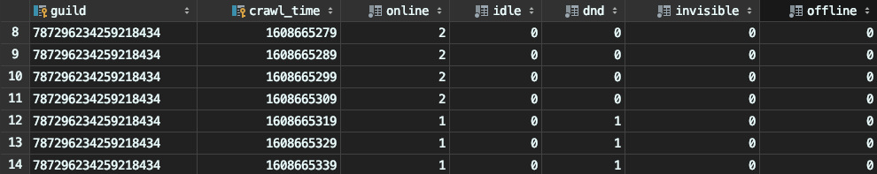

# Discord Presence Bot 
"Discord Presence Bot" is my very first attempt with GoLang. I just wanted to try out a few small functions here.  
The bot saves every `x`-seconds the number of members who are online (see example data) and stores it in a SQLite3 database.

### How to use
```bash
$ go get .
$ go build .
$ cp .env.example .env
$ vim .env # update values
$ ./discord-presence-bot # [options]

# or

$ make setup
```

**To compile for nearly ever os and platform use:**
```bash
$ make compile
```

### Database
**Note:** Although `invisible` and `offline` are also stored in the database, the Discord API **does not return them correctly**.  
Therefore the values in the columns are always `0`.

I added them anyway, because I want to look for a way later to have the correct numbers written in here as well.



### Params
The parameters are displayed when the `--help` flag is passed:
```
Usage of ./discord-presence-bot:
  -d duration
        Update delay (default 30s)
  -g string
        Guild-ID
  -t string
        Bot Token (more or less required, see below)
```
If no bot token is found, the program searches for the `BOT_TOKEN` in the `.env` file.  
If none is specified here either, the program terminates.